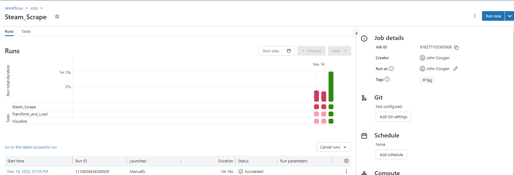
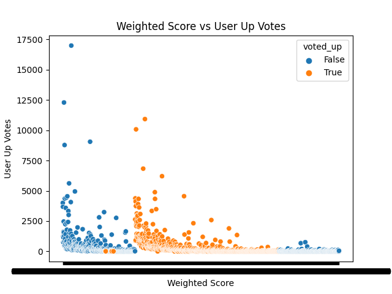

# Azure Databricks ETL Pipeline

## Overview
This project is an end to end data pipeline which takes raw, web scraped, data for video game reviews on the Steam platform, processes them through a scheduled ETL Databricks pipeline and produces useful visualizations about the data. This workflow pulls the first n number of positive and negative reviews of a specific video game and processes that data. This can be used to continuously update business intelligence for game developers. This project also leverages the value of Delta Lake storage by allowing reviews from multiple games to continuously update the Delta Lake with time travel capability to revert back to previous states. This data sink also allows for multiple workflows to transform and query the data without downtime. 

This project architecture is built on the maturin python package which facilitates python-rust development. By having this structure, performant code can be written in Rust which can then be packaged in python for use in python scripts. This is a feature of this project structure that will be implemented in later iterations as the data becomes significantly larger. By having the option to call Rust functions in python scripts, and because this projects utilizes Azure network resources, prototyping locally and deploying with performant code can drastically minimize cost. 

## Project Design
This project begins with the problem statement: How can a Game Developer more easily parse the data available to make more informed decisions regarding their games. Steam reviews can provide a massive amount of information to a game developer but are not infrequently in excess of hundreds of thousands of reviews. This can make informed decision making difficult. This project establishes an automated pipeline for a developer to request scheduled information regarding their games reception on the popular platform. 

This project uses notebooks developed on github codespaces and a repository linked to Azure Databricks. This allows for good notebook backup but also leverages githup actions CI/CD capabilities through automated lint, format, and test. Below we can see what the Azure workflow associated with the repository notebooks looks like:

The extract script utilizes the requests package to source steam reviews and convert them from json to parquet file formats. These parquet file formats are saved in auxiliary storage for later use. The script also writes the json file format to a dataframe and subsequently to a delta table utlizing pyspark. This allows for naturally integrated archiving while directly servicing business insights in later notebooks. 

The transform and load script selects columns of interest and removes unecessary data which comes with the breadth of the json webscrape. It then loads this refined data into a delta table for visualization.

Finally, a visualization notebook uses the generated delta table to perform quick visualizations and save them to the projects data folder. Below we see a visualization for reviews of the game No Man's Sky. This plot shows the relationship between User Up Votes of other people's reviews and the Steam calculated weighted vote score:

This plot is generated dynamically at the end of a scheduled pipeline so the plot we generate today could look very different than the plot we generate a week from now. It will contain the most up to date information. This plot specifically provides interesting insights about the relationship between what user's consider to be a valuable review and what steam weights as a valuable review. The fact that these are inverse is an interesting look into behavioral psychology.

This plot, incidentally, gives us more insight into a Steam business decision than the developers of No Man's Sky. It is clear that Steam's weighted vote score has an inverse relationship with the User Up Votes (a passable metric for user defined review quality). This being the case, they should seriously consider redefining the equation for weighted vote so that it more closely correlates with user up votes. 

